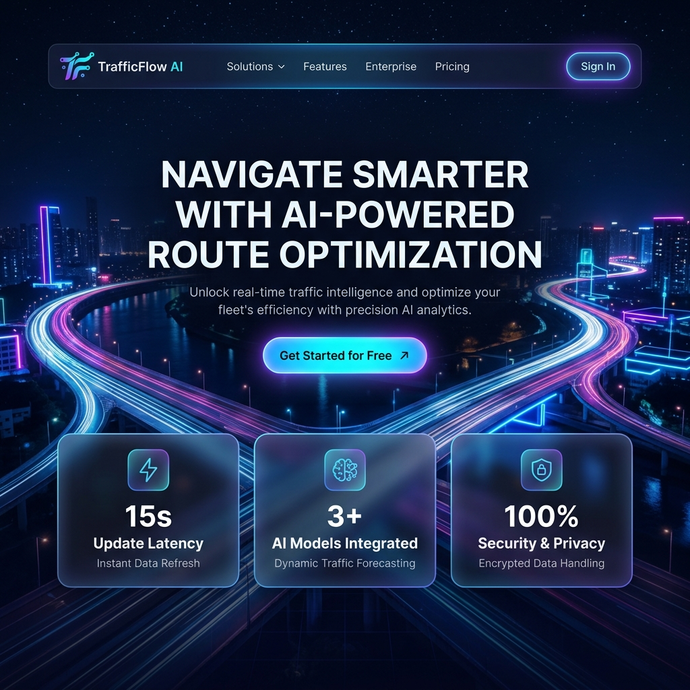
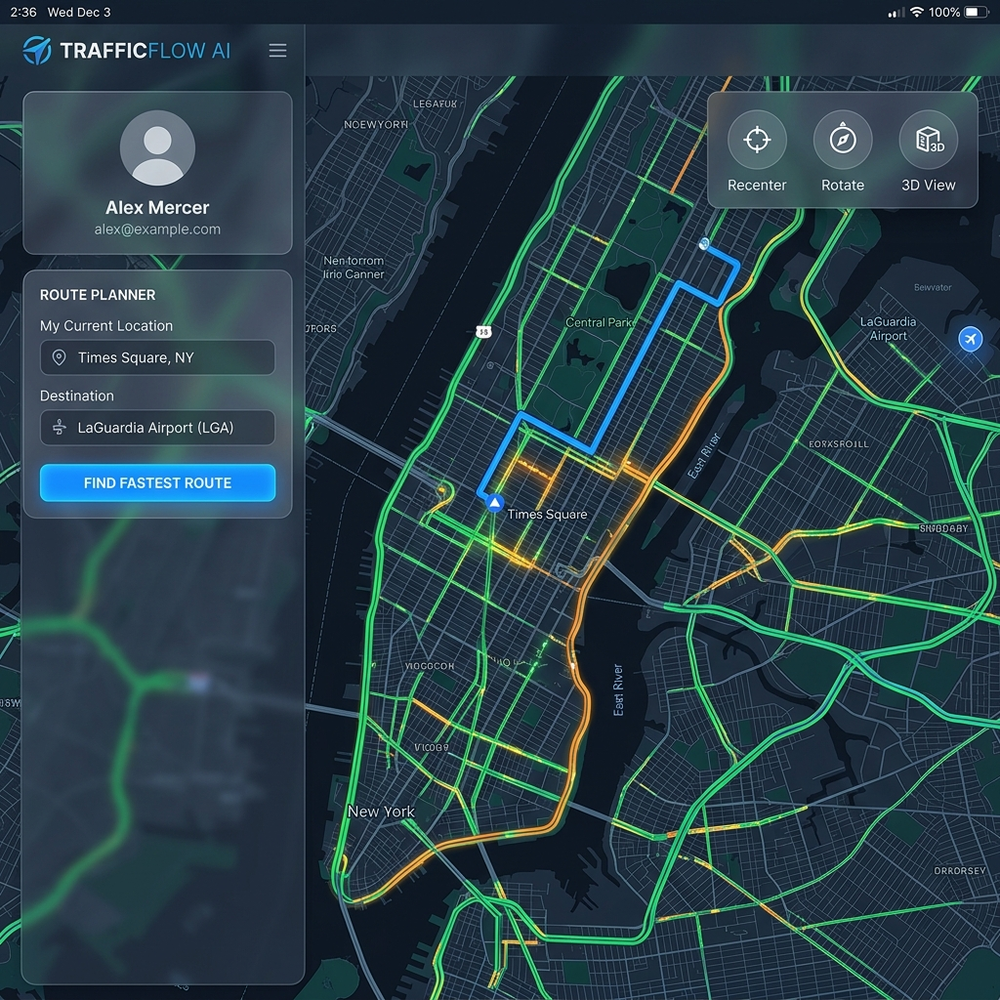

# 🚦 TrafficFlow AI — Intelligent Routing & Navigation Ecosystem

[](https://vite.dev/)
[](https://react.dev/)
[](https://supabase.com/)
[](https://www.mapbox.com/)
[](https://developer.tomtom.com/)
[](https://vercel.com/)

> **Live Demo**: [trafficflowai.vercel.app](https://trafficflowai.vercel.app)

TrafficFlow AI is a professional-grade, state-of-the-art navigation web application that merges advanced Mapbox-based route optimization with real-time GPS simulation, live weather mechanics, and an integrated AI Cognitive Advisor. Built using React, Vite, and Supabase, it offers a premium user experience featuring modern glassmorphic panels, dynamic weather canvases, and precise road-snapping turn-by-turn navigation.

---

## 📸 Screenshots

| Landing Page | Map Dashboard |
|---|---|
|  |  |


---

## 🚀 Key Features

### 1. 🗺️ Mapbox GL JS Integration & Intelligent Fallbacks
- **Primary Engine**: Mapbox GL JS (`mapbox-gl`) for high-fidelity 3D map rendering, smooth rotation, and custom HTML markers.
- **Dynamic Style Syncing**: Automatically switches map styles based on theme and Climate Engine controls:
  - **Day Mode (Light)**: Clean, high-legibility `mapbox://styles/mapbox/streets-v12` map.
  - **Night Mode (Dark)**: Sleek, eye-soothing `mapbox://styles/mapbox/dark-v11` map.
- **Alternative Routes**: Computes up to 3 alternative paths: Fastest Route (Best Recommended), Alternative Route (Balanced/Bypass), and Via City Roads (Urban streets).
- **Auto Fallback Chain**: If Mapbox directions API fail, the system automatically falls back to OpenSource Routing Machine (OSRM) -> local simulated geometry.
- **Single Selected Path Focus**: Draws only the currently selected active route, keeping the map visual clean and uncluttered.
- **Real-time Traffic Updates**: TomTom Live Traffic API integration polls every 60 seconds to update congestion labels and ETA multipliers.

### 2. 📍 Professional GPS Navigation HUD & Road Snapping
- **Live GPS Tracking**: Uses browser Geolocation API to track the user's position in real-time on the map.
- **Road Snapping**: Raw GPS coordinates are snapped to the nearest point on route geometry, preventing drift off-road.
- **Directional Bearing Arrow**: Calculates heading in degrees `[0, 360)` and rotates a premium navigation cursor to face the direction of travel.
- **Arrival Detection**: Detects when user enters within 300m of destination and shows a celebration toast.
- **Route Simulation Mode**: Animated auto-drive simulation along the computed route geometry, complete with auto-camera following, 3D tilt, dynamic bearing alignment, and an arrival toast completion handler.

### 3. 🔍 Integrated Places Search & Autocomplete
- **Mapbox Geocoding API** as primary provider for fast, localized search with proximity bias based on current location.
- **Fallback Chain**: Photon API (free, OpenStreetMap-based geocoding) for high-availability lookup.
- **Search History**: Last 5 destinations are saved per user in Supabase and shown in the sidebar for quick re-access.
- **Map Click Geocoding**: Long-tap/click anywhere on the map to set a destination directly.

### 4. 🌦️ Climate Simulation & Time Engine
- **Day-Night Cycle Overlays**: Ambient CSS overlays for Day, Sunrise (orange glow), Sunset (violet), and Night (deep dark).
- **Animated Weather Canvas**: HTML5 Canvas renders real-time falling rain particles and drifting fog clouds over the map.
- **Live OpenWeatherMap Sync**: If an OpenWeatherMap API key is configured, fetches live weather and day/night cycle automatically based on start location.
- **Collapsible Climate Engine Panel**: Floating "Climate Engine" trigger button on the map expands a weather+time control widget.

### 5. 🤖 AI Cognitive Advisor
- A dedicated sidebar tab powered by your choice of LLM:
  - **Google Gemini** (gemini-2.5-flash / gemini-2.0-flash)
  - **OpenAI** (gpt-4o / gpt-3.5-turbo)
- **Rich Text / Markdown Support**: Automatically parses `**bold**` headers and parameters into styled bold badges for a sleek presentation.
- **Context-Aware Recommendations**: Automatically reads your start location, destination, travel mode, and route parameters to generate intelligent traffic analysis, ETA predictions, and navigation tips.

### 6. 🔐 Authentication & User Profiles
- **Email/Password Auth** with email verification via Supabase GoTrue.
- **Google OAuth** one-click sign-in.
- **Settings Modal**: Authenticated users can save their private API keys (Mapbox Access Token, TomTom, OpenWeather, AI API keys) to their cloud profile via Supabase RLS.
- **Local Cache Fallback**: Saves credentials to `localStorage` immediately upon update, ensuring the app loads key configs instantly on page refresh.

### 7. 📱 Mobile-First Responsive Design
- Fully responsive across desktop, tablet, and mobile viewports.
- Sidebar collapses into a bottom slide-over drawer on mobile with backdrop tap-to-close.
- Weather trigger button collapses to an icon-only pill on narrow screens.
- **Layered Back-Gesture Navigation**: On mobile browsers, pressing the back button closes active UI elements step-by-step (Modals → Weather Panel → Suggestions → Sidebar) before prompting to exit the app.

---

## 🛠️ Technology Stack

| Layer | Technology |
|---|---|
| **Front-End Core** | React 18, Vite 8 (Fast HMR), ES6+ JavaScript |
| **Styling** | Vanilla CSS — Design Tokens, CSS Variables, Glassmorphism, Micro-animations |
| **Icons** | Lucide React |
| **Database & Auth** | Supabase (PostgreSQL, GoTrue, Google OAuth, Row Level Security) |
| **Mapping Engine** | Mapbox GL JS (`mapbox-gl`) |
| **Routing Engines** | Mapbox Directions API & OSRM (Open Source Routing Machine) |
| **Geocoding Search** | Mapbox Geocoding API & Photon (OpenStreetMap geocoding fallback) |
| **Live Traffic** | TomTom Traffic Flow API (optional) |
| **Live Weather** | OpenWeatherMap API (optional) |
| **AI Advisor** | Google Gemini & OpenAI |
| **Hosting** | Vercel (Edge Network, Serverless Functions) |

---

## 📂 Supabase Database Schema

Create the following tables in your Supabase project's **SQL Editor**:

```sql
-- 1. USER_SETTINGS Table — stores per-user API keys and preferences
CREATE TABLE IF NOT EXISTS public.user_settings (
    user_id UUID PRIMARY KEY REFERENCES auth.users(id) ON DELETE CASCADE,
    theme TEXT DEFAULT 'dark',
    mapbox_key TEXT DEFAULT '',
    tomtom_key TEXT DEFAULT '',
    open_weather_key TEXT DEFAULT '',
    ai_provider TEXT DEFAULT 'gemini',
    ai_key TEXT DEFAULT '',
    updated_at TIMESTAMPTZ DEFAULT NOW()
);
ALTER TABLE public.user_settings ENABLE ROW LEVEL SECURITY;
CREATE POLICY "Users can view their own settings" ON public.user_settings FOR SELECT USING (auth.uid() = user_id);
CREATE POLICY "Users can insert their own settings" ON public.user_settings FOR INSERT WITH CHECK (auth.uid() = user_id);
CREATE POLICY "Users can update their own settings" ON public.user_settings FOR UPDATE USING (auth.uid() = user_id);

-- 2. SEARCH_HISTORY Table — stores last 5 destination searches per user
CREATE TABLE IF NOT EXISTS public.search_history (
    id UUID PRIMARY KEY DEFAULT gen_random_uuid(),
    user_id UUID NOT NULL REFERENCES auth.users(id) ON DELETE CASCADE,
    name TEXT NOT NULL,
    coordinates JSONB NOT NULL,
    created_at TIMESTAMPTZ DEFAULT NOW()
);
ALTER TABLE public.search_history ENABLE ROW LEVEL SECURITY;
CREATE POLICY "Users can view their own search history" ON public.search_history FOR SELECT USING (auth.uid() = user_id);
CREATE POLICY "Users can insert their own search history" ON public.search_history FOR INSERT WITH CHECK (auth.uid() = user_id);
CREATE POLICY "Users can delete their own search history" ON public.search_history FOR DELETE USING (auth.uid() = user_id);
```

---

## ⚙️ Environment Variables

Create a `.env` file in the root directory:

```env
# Supabase (required)
VITE_SUPABASE_URL=https://your-project-id.supabase.co
VITE_SUPABASE_ANON_KEY=your-supabase-anonymous-key
```

> [!WARNING]
> **Never commit personal API Keys** (Mapbox Access Token, TomTom, OpenWeatherMap, Gemini/OpenAI keys) to your GitHub repository. TrafficFlow AI provides a secure in-app **Settings Modal** where authenticated users can input and save their private keys — stored securely per user via Supabase RLS and cached locally in their browser.

---

## 📦 Local Setup Instructions

### Prerequisites
- Node.js **v18+**
- A [Supabase](https://supabase.com/) project with the tables above created
- A Mapbox Access Token (Optional but required for map visualization)

### Steps

1. **Clone the Repository**:
   ```bash
   git clone https://github.com/Rupam852/TRAFFICFLOW-AI.git
   cd TRAFFICFLOW-AI
   ```

2. **Install Dependencies**:
   ```bash
   npm install
   ```

3. **Configure Environment Variables**:
   ```bash
   cp .env.example .env
   # Fill in VITE_SUPABASE_URL and VITE_SUPABASE_ANON_KEY
   ```

4. **Start the Development Server**:
   ```bash
   npm run dev
   ```
   Open `http://localhost:5173/` in your browser.

5. **Build for Production**:
   ```bash
   npm run build
   ```

---

## 🗂️ Project Structure

```
TRAFFICFLOW-AI/
├── public/
│   ├── favicon.png           # 64x64 app icon
│   ├── favicon-32.png        # 32x32 browser tab icon
│   ├── favicon-192.png       # Android / PWA icon
│   └── favicon-512.png       # Apple Touch icon (512x512)
├── src/
│   ├── components/
│   │   ├── AiPanel.jsx       # AI Cognitive Advisor panel
│   │   ├── Auth.jsx          # Login / Sign Up screens
│   │   ├── LandingPage.jsx   # Public landing page
│   │   ├── MapView.jsx       # Mapbox GL JS canvas + overlays
│   │   ├── SettingsModal.jsx # API key configuration modal
│   │   ├── ShareEtaModal.jsx # Journey share modal
│   │   └── Sidebar.jsx       # Navigation sidebar panel
│   ├── lib/
│   │   └── supabase.js       # Supabase client initialization
│   ├── utils/
│   │   └── usage.js          # API usage tracking helpers
│   ├── App.jsx               # Main app logic and state orchestration
│   ├── index.css             # Global design system (tokens, animations, responsive)
│   └── main.jsx              # React root entry point
├── api/
│   └── ping.js               # Vercel serverless health-check endpoint
├── index.html                # App shell (title, favicons, font imports)
├── vite.config.js            # Vite build configuration
└── supabase_setup.sql        # Full SQL setup script for Supabase tables
```

---

## 🚀 Deployment (Vercel)

TrafficFlow AI is optimized for zero-configuration deployment on [Vercel](https://vercel.com/):

1. Push your code to GitHub.
2. Connect the repository to a Vercel project.
3. Add environment variables in Vercel Dashboard:
   - `VITE_SUPABASE_URL`
   - `VITE_SUPABASE_ANON_KEY`
4. Deploy — Vercel will auto-detect Vite and run `npm run build`.

---

## 📋 API Keys Reference

| Service | Purpose | Required? | Free Tier |
|---|---|---|---|
| [Mapbox](https://www.mapbox.com/) | Map rendering, Places autocomplete, Directions routing | ✅ Required | 50,000 loads/month |
| [TomTom](https://developer.tomtom.com/) | Live traffic flow data | ⚡ Optional | 2,500 requests/day |
| [OpenWeatherMap](https://openweathermap.org/api) | Live weather & day/night sync | ⚡ Optional | 1,000 requests/day |
| [Google Gemini](https://ai.google.dev/) | AI Cognitive Advisor (default) | ⚡ Optional | Free tier available |
| [OpenAI](https://platform.openai.com/) | AI Cognitive Advisor (alternative) | ⚡ Optional | Pay-per-use |

---

## 📄 License

This project is for educational and portfolio use. All third-party APIs are subject to their own terms of service and usage limits.

---

<div align="center">
  <sub>Built with ❤️ by <a href="https://github.com/Rupam852">Rupam Bairagya</a></sub>
</div>
